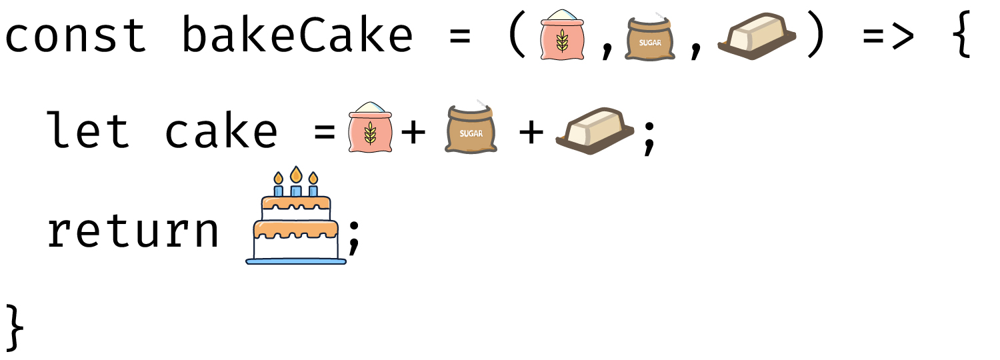

# 1.10—JS Functions: Do One Thing Well

<p style="display:none"></p>

## Start Your GH Workflow

Remember, before you start anything else, always follow this GH methodological workflow:

1. Create meaningful **branch** that uses the agreed upon naming scheme: `CHP/X.x--lastname`.
2. Practice the iterative process to **commit** and **push** regularly with meaningful **commit messages**.

## Overview

We've learned a lot so far about JS: data primitives and types, operators, conditionals, loops and parsers, and other types of transformers. Now, one of the last fundamentals to learn about JS is the ability to wrap up some code that performs one functional action well.

## What is a function?

A ***function*** is way of bundling up code to perform specific tasks. It's like writing a more general procedure, which you give a name, that when you call that name, the proceudre runs on command.

<figure>
  
  <figcaption>Test</figcaption>
</figure>

Functions are useful because they can help make your code more organized and save you from repetition. If you have to do some task over and over again, you don't want to write out the same code over and over again from scratch.  In other words, if you find yourself ... repeating yourself, it may makes sense to define *one function* that can take in the data as a parameter, then return the changed data to another spot in your program.

Let's focus on some fundamentals.

## 1. *Defining* a Function

In the current standard of JS, a function is composed of a sequence of statements called the *function body*. Values can be passed to a function as *parameters*, and a function can, and normally should *return* a value.

Below is the basic structure of a basic function body using the arrow notation approach.

<!-- Example JS function structure -->
```javascript
const bakeCake = (flour, sugar, butter) => {
  // A silly example of doing something with the parameters
  let newCake = flour +" + "+ sugar +" + "+ butter + " = Best Cake Ever"

  // return the desired output cake back to where the function is called
  return newCake
}
```

Let's really break down the parts of the arrow function `bakeCake()`:

1. Instantiate a *constant* variable. Think of it like casting a magical spell!
    ```javascript
    // Notice how the name uses a verbObject
    const bakeCake
    ```
    <div class="tip">
      <p>
        Always write an appropriate and meaningful verb to start the name of your function. Ask yourself: <em>What is this function doing?</em>.
      </p>
      <p>
        If your function is adding new date information by converting a <code>Date()</code> object into new date fields, then perhaps we could name the function, <code>addNewDateFields</code>.
      </p>
    </div>
2. Assign parameters to the function with variable names contained within parantheses:
    ```javascript
    // Notice how the name uses a verbObject
    const bakeCake = (flour, sugar, butter)
    ```
    <div class="note">
      <ul>
        <li>
          Parameters are variables scoped for use only within the function's body
        </li>
        <li>
          You can add as many as parameters as you need.
        </li>
      </ul>
    </div>
3. Write arrow notation and curly braces, which defines the body of the function and its scope: ` => `.
    ```javascript
    // Notice how the name uses a verbObject
    const bakeCake = (flour, sugar, butter) => {}
    ```
4. Write your procedure within the scope of the function's body.
    ```javascript
    const bakeCake = (flour, sugar, butter) => {
      // Note how we use the parameters
      let newCake = flour +" + "+ sugar +" + "+ butter + " = Best Cake Ever"
    }
    ```
5. The last line of any function before it closes with the curly brace is its `return` statement.
    ```javascript
    const bakeCake = (flour, sugar, butter) => {
      let newCake = flour +" + "+ sugar +" + "+ butter + " = Best Cake Ever"

      // return the desired output cake back to where the function is called
      return newCake
    }
    ```

## 2. *Using* a Function

So, how do you use this awesome new, custom function? Easy, you can ***call*** it once it has been defined.

Let's call `bakeCake()` from before.

<p class="codeblock-caption">
  How to call the example <code>bakeCake()</code> function.
</p>

```javascript
let amazingCakeFlour = "Best Clake Flour Ever"
let crystalSugar = "Best Sugar Ever"
let butteriestButter = "Best Butter Ever"

let bestCakeEver = bakeCake(amazingCakeFlour, crystalSugar, butteriestButter)
// bestCakeEver == "Best Clake Flour Ever + Best Sugar Ever + Best Butter Ever = Best Cake Ever"
```

## 3. *Hoisting* Parameters

Parameters are input values that you ***hoist*** into functions defined elsewhere in your project.

While you are not required to hoist parameters to functions, functions often accept parameters to use as locally named and scoped variables to the function.

In other words, each parameter is a simple identifier that you can access within the local scope of the function's body, i.e., between the curly braces `{...}`.

```javascript
const bakeCake = (flour, sugar, butter) => {
  /**
   * ACCESS:
   * You CAN access the values of `flour`, `sugar`, and `butter`
   * within the scope of the function.
  **/
}

/**
 * NO ACCESS:
 * You CANNOT access the function's `flour`, `sugar`, and `butter`
 * variables oustide of bakeCake()
**/
```

## 4. *Returning* Values

The `return` statement allows you to return an arbitrary value from a function. ***One function call can only return one value***. But, you can simulate the effect of returning multiple values by returning an object or array and destructuring the result.

<p class="warning">
  By default, if a function's execution doesn't end at a return statement, or if the return keyword doesn't have an expression after it, then JS' default return value is the <code>undefined</code> data primitive.
</p>

## 5. Best Practices for Functions

Functions in all programming languages typically are best written to perform one complete action well. This is also why functions only return one value. In other words, don't write functions that are Jacks of All Trades.

For example, it doesn't make sense to write a function that converts dates in your data AND convert all strings to lowercase characters. Those are distinct functions that should be written separately of each other.

Overall keep that rule-of-thumb in mind as you practice writing functions.

## Exercises

<p class="note--data">
  For our exercises, we will again use the randomly generated sample of 20000 <strong>absentee</strong> NC voter data from the 2024 election cycle. The original set has over 468000 rows, so I reduced it to a smaller number to balance computational performance without forsaking much of the distribution of the full dataset. The data has been anonymized.
</p>

## E1. Attach the dataset

Use D3.js `FileAttachment()` method below in VS Code. Remember that you'll need to write a relative path as a String parameter that helps the computer find where the CSV file is in relation to this particular page's file in the project tree.

<!-- Attach sampled NC voter data -->
```javascript
// Convert to `js` codeblock and attach sampled NC voter data file:
// nc_absentee_mail_2024_n20000.csv
```

## E2. Convert String dates to Date() objects

**Goal**: Write a function that accepts any array of objects that can convert any of its String date fields to Date() objects as a new property in the object.

First outline your procedure with steps below.

1. Enter step 1
2. Enter step 2
3. ...

Now, code!

```javascript
// Your function code goes here
```

```javascript
// Your use of the function code goes here
```

<p class="codeblock-caption">
  E1 Interactive Output
</p>

```javascript
// Convert and output variable here
```

## E3. Create Your Own Function (with Conditions)!

**Goal**: Write your own function using the 2024 absentee NC voter data. The only condition is to include conditions. `:-)`

First outline your procedure with steps below.

1. Enter step 1
2. Enter step 2
3. ...

Now, code!

```javascript
// Your function code goes here
```

```javascript
// Your use of the function code goes here
```

<p class="codeblock-caption">
  E2 Interactive Output
</p>

```javascript
// Your output variable here
```

## Submission

1. Create a **PR** (**pull request**) and use the provided content in the template to start it.
2. Respond to your peers and comment on their work on at least one chapter..
3. Submit the PR link in Moodle, when you're ready.
